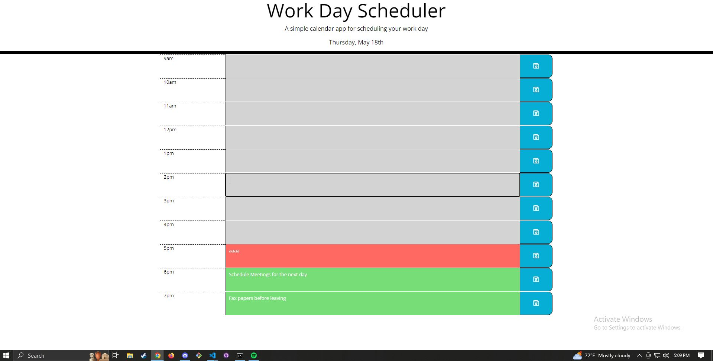

# Daily Planner

## Description

This was to create a faily planner in a normal schedule of business hours. The objective was for the past hour to be red to show that it has past and for the grayed out to show that it is way over with. The green is to show that this is the current and future events that are to happen each remaining hour of the day. There is also the displayed date and it is synced with the normal calender as well as the clock is synced as well.

## Acceptance Criteria of Assignment

```md
GIVEN I am using a daily planner to create a schedule
WHEN I open the planner
THEN the current day is displayed at the top of the calendar
WHEN I scroll down
THEN I am presented with timeblocks for standard business hours
WHEN I view the timeblocks for that day
THEN each timeblock is color coded to indicate whether it is in the past, present, or future
WHEN I click into a timeblock
THEN I can enter an event
WHEN I click the save button for that timeblock
THEN the text for that event is saved in local storage
WHEN I refresh the page
THEN the saved events persist
```

## Photo of Website



## Link to Website

[Link to Website]()